<picture>
  <source media="(prefers-color-scheme: dark)" srcset="dar.svg">
  <source media="(prefers-color-scheme: light)" srcset="ligh.svg">
  
</picture>

 

<picture>
  <source media="(prefers-color-scheme: dark)" srcset="dark.svg">
  <source media="(prefers-color-scheme: light)" srcset="light.svg">
  
</picture>

  

<!-- ============ PHASE 2 — Stats (self-hosted) ============ -->

  

<!-- ============ PHASE 3 — Contribution snake ============ -->
<picture>
  <source media="(prefers-color-scheme: dark)" srcset="https://raw.githubusercontent.com/haseebniazii/haseebniazii/output/snake-dark.svg">
  <source media="(prefers-color-scheme: light)" srcset="https://raw.githubusercontent.com/haseebniazii/haseebniazii/output/snake-light.svg">
  
</picture>

  

<!-- ============ PHASE 4 — Social badges ============ -->
&nbsp;&nbsp;
&nbsp;&nbsp;

