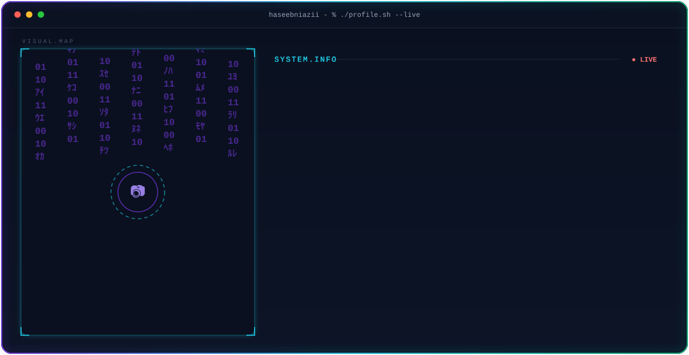

<picture>
  <source media="(prefers-color-scheme: dark)" srcset="dark.svg">
  <source media="(prefers-color-scheme: light)" srcset="light.svg">
  
</picture>

 

 

📍 Pakistan &nbsp;|&nbsp; 🎓 BSCS &nbsp;|&nbsp; 🎯 Current Focus: **AI / ML**

<!-- Add your links once ready -->

---

## 👨‍💻 About Me

I’m a **BSCS student focused on Machine Learning, Deep Learning, and Generative AI**, with a strong interest in building practical, data-driven solutions.

My journey started with **Machine Learning and Data Analysis**, where I’ve worked with Python, NumPy, Pandas, Matplotlib, and Scikit-learn across the complete ML workflow — from data cleaning and exploratory data analysis to feature engineering, model training, evaluation, and deployment.

I’m currently expanding my knowledge of **Deep Learning with PyTorch and TensorFlow**, while exploring **Generative AI and LLMs**, including Transformers, embeddings, RAG, tool calling, AI agents, fine-tuning, evaluation, and LLM deployment.

I learn by **understanding concepts, working with real-world datasets, building projects, and experimenting with different approaches**. My goal is to turn what I learn into practical projects that solve meaningful problems.

🎯 **Current Focus:** Machine Learning → Deep Learning → Computer Vision → Generative AI

---
### 🧰 Tech Stack

**Languages**

  
  
  
  

**Machine Learning & Data Science**

  
  
  
  
  
  
  
  

**Computer Vision & AI**

  
  
  

**Web Development**

  
  
  
  

**Backend & APIs**

  
  

**Deployment & AI Platforms**

  
  

**Developer Tools & Version Control**

  
  
  
  

---

## 📊 GitHub Stats

      

---

## 🌐 Connect With Me

<!-- Add your real profile links here once ready -->

---

### 🚀 *"Learning today, building tomorrow with AI"*

